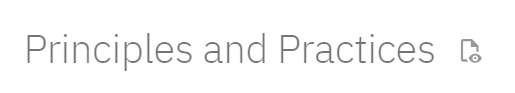

# Heimasíðugerð

*Föstudagurinn 2. október 2024 kl. 14:10*

Internetið umvefur allt í dag og það er gott að kynnast hvernig það virkar. Í Fab Academy skrásetur nemandinn allt sem hann gerir á heimasíðu.

Í fyrstu viku Pre-Fab setur þú upp heimasíðu og birtir á netinu. Við förum í gegnum ferlið á fjarfundi.

## HTML

Allar heimasíður byggja á þremur stoðum:

1. HTML [kynning](https://www.w3schools.com/html/html_intro.asp), [sýnidæmi](https://www.w3schools.com/html/html_basic.asp)
1. CSS [kynning](https://www.w3schools.com/css/css_intro.asp), [kennsla](https://www.w3schools.com/css/)
1. JavaScript [kynning](https://www.w3schools.com/js/js_intro.asp), [kennsla](https://www.w3schools.com/js/DEFAULT.asp)

Hér er HTML + JavaScript sýnidæmið sem við prófuðum á fundinum:

``` html
<!DOCTYPE html>
<html>
<head>
<title>Page Title</title>
</head>

<body>

<h1>My First Heading</h1>
<p id="demo">My first paragraph.</p>

<a href="https://fabacademy.org/2023/labs/isafjordur/students/svavar-konradsson/">Fab Academy síða Svavar</a>

<script>
document.getElementById("demo").innerHTML = "Hello JavaScript";
</script>

</body>
</html>
```

## Markdown


Í stað þess að skrifa síðuna með HTML kóða þá skrifum við í Markdown, sem er einfaldara og læsilegra, og látum Material for MkDocs um að breyta Markdown skránum í vel uppsett HTML skjal með innihaldinu okkar, CSS stílforskrift sem segir til um leturgerðir, liti og fleira, og JavaScript sem framkallar virkni síðunnar, eins og t.d. [leitarmöguleikann](https://squidfunk.github.io/mkdocs-material/setup/setting-up-site-search/). Allt sjálfvirkt og án þess að við þurfum að líta undir húddið. En það er gott að vita að það má setja HTML, CSS og JavaScript kóða inn í Markdown skjölin ef maður vill sérsníða eitthvað. Til dæmis kafaði [Doddi](https://fabacademy.org/archives/2015/eu/students/gunnarsson.thorarinn_b.b/index.html) ofan í CSS kóðann á fabisa.is til að sérsníða forsíðuna.

1. Setjið fyrst upp [Python](https://www.python.org/).
1. Næst er það Git [uppsetning](https://git-scm.com/), [tenging við heimasíðuna þína](https://fabacademy.org/2023/labs/isafjordur/students/svavar-konradsson/assignments/week01.html#git-setup).
1. Og að lokum Material for MkDocs [uppsetning](https://squidfunk.github.io/mkdocs-material/getting-started/), [stillingar](https://squidfunk.github.io/mkdocs-material/setup/), [fídusar](https://squidfunk.github.io/mkdocs-material/reference/).
1. Nú getið þið skrifað heimasíðuna ykkar í Markdown. Það er auðvelt og gagnlegt að læra Markdown [framsetningu](https://www.markdownguide.org/basic-syntax/) (t.d. eru readme skrár á GitHub skrifaðar í Markdown).

## Myndir og myndbönd 

Það er afar mikilvægt að þjappa öllum myndum og myndböndum áður en efnið er sett á heimasíðu, því að annars tekur það allt of mikið pláss og veldur tómum vandræðum.

Greenshot [uppsetning](https://getgreenshot.org/)

ImageMagick [uppsetning](https://imagemagick.org/index.php), [skipanir](https://fabacademy.org/2023/labs/isafjordur/students/svavar-konradsson/assignments/week01.html#image-compression-for-the-web)

FFMPEG [uppsetning](https://www.ffmpeg.org/), [skipanir](http://academy.cba.mit.edu/classes/computer_design/video.html)

Á Fab Academy síðunni minni útskýri ég hvernig ég nota ImageMagick til að þjappa myndum og FFMPEG til að þjappa myndböndum í terminal:

[Image compression for the web](https://fabacademy.org/2023/labs/isafjordur/students/svavar-konradsson/assignments/week01.html#image-compression-for-the-web)

[Video compression for the web](https://fabacademy.org/2023/labs/isafjordur/students/svavar-konradsson/assignments/week01.html#video-compression-for-the-web)

## Heimaverkefni

Þegar prufusíðan ykkar er komin í loftið skuluð þið nota hana til að skrásetja hvernig þið settuð hana upp. Nú er tíminn til að læra að skrifa texta sem er framsettur með Markdown, og prófa einhverja af fídusunum í Material for MkDocs. Hér getið þið skoðað það sem ég prófaði:

[MkDocs test drive](https://fabacademy.org/2023/labs/isafjordur/students/svavar-konradsson/assignments/week01.html#mkdocs-test-drive)

Athugið að þið getið skoðað Markdown skrána á bak við síðuna mína með því að smella á augað við hliðina á titlinum efst á síðunni:



Hér er Markdown skráin á bak við síðuna sem þú ert að skoða núna:

[Pre-Fab heimasíðugerð](https://github.com/fablabisastaff/fabisa_site/blob/main/docs/N%C3%A1msefni/Pre-Fab/1-heimasidugerd.md?plain=1), [commit history](https://github.com/fablabisastaff/fabisa_site/commits/main/docs/N%C3%A1msefni/Pre-Fab/1-heimasidugerd.md)