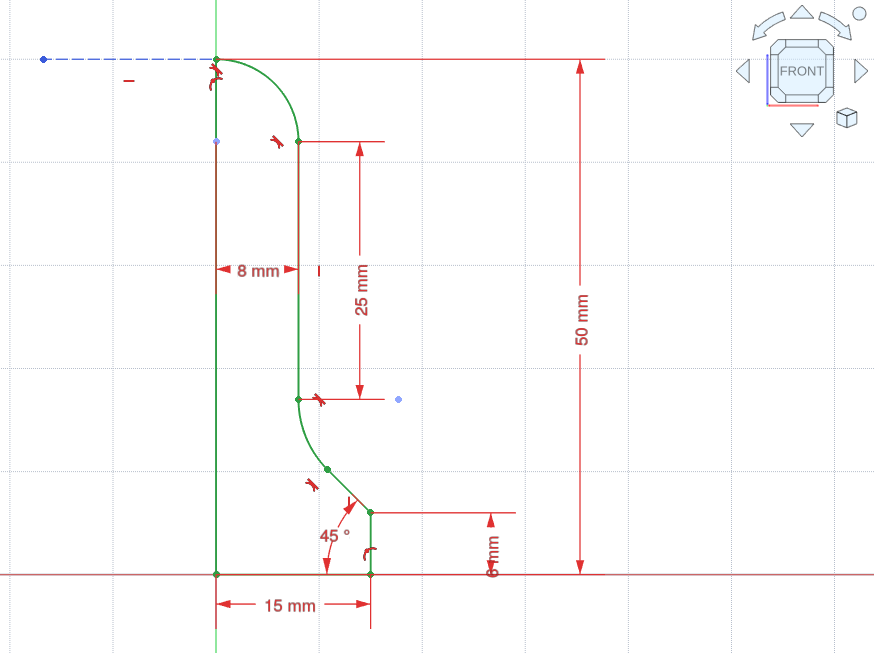
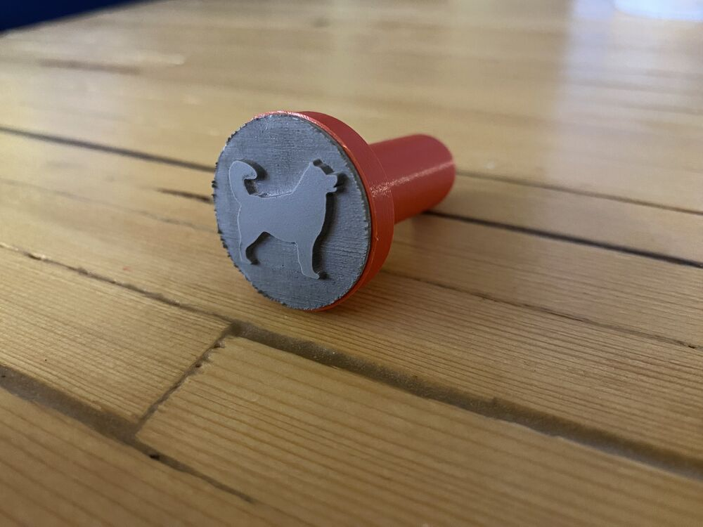

# Tölvuteikning

*Föstudagurinn 22. nóvember 2024 kl. 14:10*

Eitt af því sem Fab Academy nemendur eiga í mestum vandræðum með, en gefur þeim jafnframt mesta frelsið þegar þeir ná tökum á því, er tölvuteikning. Við skulum taka hana fyrir í þessari viku. 

Það er frábært að læra að nota öll tækin í smiðjunni, en þú getur samt ekki smíðað allt sem þér dettur í hug fyrr en þú getur teiknað það. Eftir því sem þú byggir upp teiknihæfnina þína verða tækin í smiðjunni öflugri og þú getur gert fleiri hugmyndir að veruleika.

## FreeCAD

Í þessari viku finnst mér mikilvægast að kynna málsetningar og skorður fyrir ykkur í CAD forriti. Þetta eru nauðsynleg verkfæri til að teikna nákvæma hluti og það tekur tíma að ná tökum á þeim.

Góðar stillingar í FreeCAD:

- Ég mæli með að [stilla músina svona](https://github.com/user-attachments/assets/92cc200b-430b-4a10-b6b7-a378fe45ee48).
- Þið fáið upp [Property View panel svona](https://github.com/user-attachments/assets/acdf3e7a-a5ee-46e7-9fee-77053b6b4a6a).
- Þið getið [stækkað punkta í skissum svona](images/marker-size-no-audio.mp4), svo að það sé auðveldara að smella á þá.

Ég nota "Blender mús" í FreeCAD:

Það eru til fleiri stillingar, t.d. touchpad til að teikna í fartölvu:

<iframe width="560" height="315" src="https://www.youtube.com/embed/XjdqJNcu2XA?si=lD_X31Rnz1UatJcd" title="YouTube video player" frameborder="0" allow="accelerometer; autoplay; clipboard-write; encrypted-media; gyroscope; picture-in-picture; web-share" referrerpolicy="strict-origin-when-cross-origin" allowfullscreen></iframe>

Hér eru örstutt myndbönd að hætti Neil, sem útskýra málsetningar og skorður í tvívíðum skissum:

[Sketch and Extrude](images/sketch-extrude.mp4)

[Dimensions](images/dimensions.mp4)

[Coincident Constraint](images/coincident-constraint.mp4)

[Horizontal-Vertical Constraint](images/horizontal-vertical-constraint.mp4)

[Parallel Constraint](images/parallel-constraint.mp4)

[Perpendicular Constraint](images/perpendicular-constraint.mp4)

[Tangent Constraint](images/tangent-constraint.mp4)

[Collinear Constraint](images/collinear-constraint.mp4)

[Equal Constraint](images/equal-constraint.mp4)

[Symmetric Constraint](images/symmetric-constraint.mp4)

[Block Constraint](images/block-constraint.mp4)

Verkefnið ykkar er að teikna helming af handfangi fyrir stimpil í Sketcher og nota síðan Revolve til að búa til þrívíðan hlut:

*Ég mæli með að teikna á framplanið (XZ planið). Það þarf síðan að gera smátrikk til að fá samfellda hálfkúlu ofan á handfangið. Teiknið lárétta línu út frá efsta boganum og gerið bogann tangent við hana. Til þess að þessi aukalína verði ekki tekin með í Revolve skipuninni þá þarf að [breyta henni í hjálparlínu](https://wiki.freecad.org/Sketcher_ToggleConstruction).*

*Notið Revolve skipunina í Part workbench til að breyta 2D skissunni í 3D hlut.*

## Inkscape

Inkscape er eitt gagnlegasta og mest notaða forritið í hverri Fab Lab smiðju. Ef þú þekkir það vel þá geturðu sleppt þessari æfingu.

Horfðu á 13 mínútna langa kynningarmyndbandið til þess að fá yfirlit yfir helstu verkfærin í Inkscape. 

Teiknaðu síðan einlitt lógó til að nota á Fab Academy síðunni þinni. Lógóið þarf að vera nógu einfalt til þess að sjást við hliðina á nafni síðunnar í vafraflipa. Þú getur byggt lógóið á teikningu, ljósmynd, skammstöfuninni þinni eða einhverju öðru sem þér dettur í hug. Notaðu myndböndin hér fyrir neðan eða aðrar leiðbeiningar sem þú finnur á netinu til þess að hjálpa þér að teikna.

Þið getið síðan laserskorið stimpil með lógóinu ef þið eruð í stuði. Ef þið eigið ekki til gúmmí til að laserskera, þá get ég póstlagt sýnishorn til ykkar.

### Kynning

<iframe width="560" height="315" src="https://www.youtube.com/embed/rFYQW2DCM2I?si=cjsyLpGYfjVR_OP4" title="YouTube video player" frameborder="0" allow="accelerometer; autoplay; clipboard-write; encrypted-media; gyroscope; picture-in-picture; web-share" referrerpolicy="strict-origin-when-cross-origin" allowfullscreen></iframe>

### Lógó

=== "Custom text"
    <iframe width="560" height="315" src="https://www.youtube.com/embed/BI8Nw69Vn5o?si=C3P0JmsuHpzZxg-A" title="YouTube video player" frameborder="0" allow="accelerometer; autoplay; clipboard-write; encrypted-media; gyroscope; picture-in-picture; web-share" referrerpolicy="strict-origin-when-cross-origin" allowfullscreen></iframe>
=== "Tech letters"
    <iframe width="560" height="315" src="https://www.youtube.com/embed/bKXhceZ074I?si=YPfTefsQ9ZEcDfFN" title="YouTube video player" frameborder="0" allow="accelerometer; autoplay; clipboard-write; encrypted-media; gyroscope; picture-in-picture; web-share" referrerpolicy="strict-origin-when-cross-origin" allowfullscreen></iframe>
=== "Initials"
    <iframe width="560" height="315" src="https://www.youtube.com/embed/tw6hWb58qp0?si=zY0rWEtANh56Ph4i" title="YouTube video player" frameborder="0" allow="accelerometer; autoplay; clipboard-write; encrypted-media; gyroscope; picture-in-picture; web-share" referrerpolicy="strict-origin-when-cross-origin" allowfullscreen></iframe>
=== "Elegant"
    <iframe width="560" height="315" src="https://www.youtube.com/embed/T8zqiNTwQ1I?si=JXZyeQCalsI1xDyc" title="YouTube video player" frameborder="0" allow="accelerometer; autoplay; clipboard-write; encrypted-media; gyroscope; picture-in-picture; web-share" referrerpolicy="strict-origin-when-cross-origin" allowfullscreen></iframe>
=== "Shapes"
    <iframe width="560" height="315" src="https://www.youtube.com/embed/HeRAFSX2vaM?si=E6WS9qFvl7I4AI1k" title="YouTube video player" frameborder="0" allow="accelerometer; autoplay; clipboard-write; encrypted-media; gyroscope; picture-in-picture; web-share" referrerpolicy="strict-origin-when-cross-origin" allowfullscreen></iframe>
=== "Strokes"
    <iframe width="560" height="315" src="https://www.youtube.com/embed/UEnMwZuqr3o?si=LGe2-wkjX-d_68s_" title="YouTube video player" frameborder="0" allow="accelerometer; autoplay; clipboard-write; encrypted-media; gyroscope; picture-in-picture; web-share" referrerpolicy="strict-origin-when-cross-origin" allowfullscreen></iframe>

### Stutt ráð

Hér eru örstutt myndbönd sem fara yfir Inkscape verkfæri á ofurhraða. Þú getur athugað hvort eitthvert þeirra gagnist þér í lógóhönnuninni. Hugsanlega fara þau of hratt í hlutina.

[Unique typography](https://youtube.com/shorts/em8nQeE5DJw?si=VTxHrGTx2De6PPXO)

[Perspective text](https://youtube.com/shorts/xqJQoxrLJak?si=QxAKnAELnC6rmQ0t)

[Rotate pattern](https://youtube.com/shorts/uJny3tSsH-4?si=oLoyM83aODeDYN8v)

[Object division](https://youtube.com/shorts/6jVaVTWy6V4?si=liCpuGmNC06gLmWK)

[Blur text effect](https://youtube.com/shorts/z_I19C8CeVM?si=yiZrHenIUEQ3MiiO)

[Manual image trace](https://youtube.com/shorts/9ubDEmB1WIs?si=OJIgRpgouonT2n9t)

[Round selected corners](https://www.youtube.com/shorts/mEf7hbSWMuU)

[Sunburst](https://youtube.com/shorts/w9TJbzb1QaE?si=MVPyLAdqKGhxyWuE)

[3D cubes](https://youtube.com/shorts/mRVhNyXCDUQ?si=KCQneC4g3Fjd_wfu)

[How to round corners](https://youtu.be/WX65w47BmSA?si=EYEa0cCDWuW3X6d-)

[Smooth paths after drawing](https://www.youtube.com/watch?v=EFHLF1hcrjg)