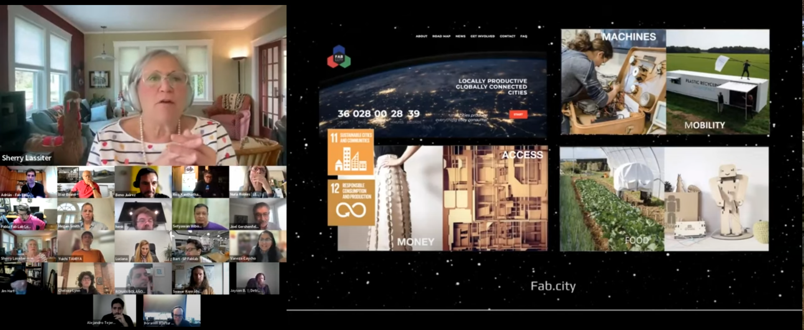

# Fab All-In

Smiðjan hefur tekið þátt frá því 2022 í Fab All-in. þar er lög sérstök áhersla á áhrif sem fab lab smiðjur geta haft óháð tækni.

Námskeiðið stendur yfir frá febrúar til maí á hverju ári. Smiðjan hefur aðstoðað við að þróa kennsluna.

## upplýsingar á ensku

Designed to increase belonging, expand (inclusive, urgent, enivro-social-econ-cultural-etc) impact, and create community
___

Does your fab community match the make-up of your whole community, with all neighbors feeling welcome, showing up, leading, financially supported, visible, and …?

* If yes, please join us and come share your work and methods along with others!
* If not, come join us – and hear different ways others have been solving for inclusive Fab communities! You can do this!
* Either way, or not exactly applicable? [Come join us](https://form.jotform.com/233204082631647){:rel="nofollow"}

This interactive set of eight sessions builds skills, knowledge, and capability around the social systems needed to co-evolve with digital fabrication technologies.

**We call it “Fab All-In” to signal that both “all topics” and “all people”** could experience welcome in the journey to positive social, economic, environmental creative impact, personal self-expression, leadership/leader-shop, and community self-sufficiency.”

### Course Structure:

* We begin by hearing innovators from the FabLab network sharing some innovations already happening in this way. 
    *Themed sessions with a series of short presentations from regional leaders elevate stories of existing exceptional work from teams around the world – especially hearing from labs and initiatives that have scaled inclusive to those people and topics that have been under-represented in the Fab network.
    *Each session will also feature application opportunities and interaction— including a curriculum for exploring and developing plans, dialog with colleagues, sharing more details about challenges with solutions people developed iteratively, and conducting collaborative project development input sessions.
* Two skills deep-dive sessions later in the semester will workshop several skills areas, plus an optional open-office hours session for co-working time.
* The final session will be a Solutionspalooza to share early solutions-in-progress and hear more details about emerging initiatives we discover along the way.

If you are interested in learning more, check out our recitation from the 2023 Fab All-In Recitation from last spring: [May 2023 Fab Academy Fab All-In Recitation](https://www.youtube.com/watch?v=7f9MSwHRbUA){:rel="nofollow"}

**We request applying by January 19th, 2024! Limited scholarships are available.** _(note: if you miss the deadline, please still sign up)_

[Join us](https://form.jotform.com/233204082631647){:rel="nofollow"}
Tuition Fee: 100USD$

___

#### Learning Objectives
* Become aware that other colleagues have already solved hard inclusion challenges. Gain comfort in how to approach and solve inclusion faster, together;
* Learn how to collaboratively lead community change initiatives;
    * Foster inclusivity by gender, race, economic status, geography, caste, and other forms of identity — as well as foster inclusion by topics or subjects of work;
    * Empower a more natural and culturally-aware context for digital fabrication by engaging broader talent inclusion;
    * Promote economic vitality and community self-sufficiency;
    * Appreciate, explore and consider how to see, address, and counter tech bias;
* Share what you have innovated and learn with others; and
* Join this cool emergent community of practice.

___

### Curriculum Overview

This series of eight community-led sessions are held from **9:00-11:00am US EST**. It will include practical support (and your own projects) centered on building inclusive communities around digital fabrication. 

**Here is a preliminary listing of topics and presenters from the learning community:**

#### Fab All In - Spring 2024
*final content will vary as scheduling comes together
**8 Sessions Feb 5 - May 13-14, 2024**

* Session 1: All-In -- February 5, 2024
* Session 2: Systemic All-in Impact – February 19, 2024
* Session 3: The Natural/Cultural Context  -- -- March 4, 2024 
* Session 4: —Skills + Workshop-Office Hours-- March 18, 2024 
* Session 5: Economic Vitality -- April 15, 2024
* Session 6: —Skills + Workshop-Office Hours --April 29, 2024 
* Session 7: —Final Co-work Session (Optional) – May 6, 2024
* Session 8: Solutionspalooza -- May 13, 2024 and May 14, 2024 (double session)

___

#### Session 1 :  Systemic All-in Impact 

* **Welcome** 
* **Stories** 
    * Welcome from Around the World - Sherry Lassiter, Beno Juarez, Pradnya P Shindekar, Rico Kanthatham, Nuria Robles **Peru, Spain, India, United States, Japan**
    * Solution Making Through Inclusion/ Scout & Scale + Tech/Learning Bias - Megan Smith, **shift7 United States**
    * Highlights from Year 1 - Insights from the first Cohort **Global**
    * Fab Academany Overview - Neil Gershenfeld **United States**
* **Project Guidance:** Observe patterns of interaction in a fab lab; Begin to consider an achievable change objective (but don’t select until after observations); start to observe and explore relevant indicators.

**Introduce tools, sites, and resources**

___

#### Session 2:  Systemic All-in Impact 
**Check in**

**Stories:**
* Gender Inclusion: Nuria Robles, **Fab Lab León, Spain**
* Neighborhood Outreach: Dan Meyer, **United States**
* Rural Sustainability: Pradnya P Shindekar, **Pioneer edu tech pvt ltd, India**
* Intentional Inclusion: Felicity Mecha, **Kenya**
* Connected Social Networks: Adrian Torres **Alumni**
* Intergeneration Inclusion - Remy Ducros **Alumni**

**Project Guidance:**  Test out a “positive nudge” in the patterns of interaction

___

#### Session 3: The Natural/Cultural Context 
**Check in**

**Stories:**
* Amazon Wardens: Beno Juarez, **Amazon, Peru**
* Intergenerational Learning: LeeAnn Garrick, **Cook Inlet Tribal Council, Anchorage, United States**
* Self-Sufficient Community and Culture:  Blair Evans, **Incite-Focus, Detroit, United States**
* Circular Economy with Natural Materials:  Alysia Garmulewicz and Pilar Bolumburu, **Santiago, Chile**
* Rural Community Revitalization: Setyawan Wibowo **Indonesia**
* Fab Cities: Tomas Diez **Barcelona, Spain** 

**Project Guidance:**  Document early indicator results; Assess underlying forces and factors; Adapt and adjust.

___

#### Session 4: Skills Workshop & Office Hours
**Check in**

**Skills Development (Interactive Session)**

**Office Hours**

___

#### Session 5: Economic Vitality
**Check in**

**Stories:**
* Italy COVID response: Martina Ferracane **Sicily, Italy**
* Digital Fabrication in Refugee Camps: Andrew Lamb **London, England**
* creative logistics: Þórarinn Bjartur Breiðfjörð **Ísafjörður, Iceland**
* Worker Ownership/Self-sufficiency: Danny Beesley **Austin, United States**
* Fabricademy, Textile & Technology Academy: Cecilia Raspanti & Anastasia Pistofidou (cofounders) **Global** and Nuria Robles **Fab Lab León, Spain**
* Considering the UN Sustainable Development Goals in Fab Labs: Pieter van der Hijden **Alumni**
* iFurniture and the Digital Carpentry Ecosystem: Vaneza Caycho **Alumni**

**Project Guidance Workshop:** Document continued indicator results; Develop sustainability plan.

___

#### Session 6: Workshop & Office Hours
**Check in**

**Skills Development (Interactive Session)**

**Office Hours**

___

#### Session 7: Final Co-work Session (Optional)

**Co-work Time for Final Projects and Open Office Hours**

___

#### Session 8: Solutionspalooza
**Check in**

**Presentations and Celebration:** Participants share their projects and already-existing-work stories (All presenters and alumni encouraged to come!).

_[End of Syllabus]_

___

#### Fab All-In Faculty:

Fab All-In has been co-created by a team of Fab Lab community colleagues working with Fab Foundation leadership – our Fab All-In Faculty is from all over the world.  The 1st Fab All-In Course Program of 6 sessions was held during the Fall of 2022.  We also held a recitation sampler (1 hour) in May 2023 as a session in Fab Academy spring 2023.

For the 2nd Fab All-In Course Program - Spring 2024, there will be 8 sessions outlined above – our collaborative faculty continues and we also welcome several alumni of session-1 to join in sharing-teaching-co creating the Fab All-In course. 

