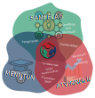

---
hide:
  #- navigation
  - toc
---

# Kjarna starfsemi

{ align=left }

---

Smiðjan heldur upp og tekur þátt í ýmismverkefnum sem tengjast öll kjarna starfsemi smiðjunar sem snýst um að vinna með menntun, atvinulífinu og samfélagi til að búa til öflugan vetvagn sköpunar og leiða saman enstaklinga, fyrirtæki og tengja saman ýmis verkefni.

---
        
## Menntun:

- **Fókus:** Styrkja nemendur og kennara til að nota stafræna framleiðslutækni og efla sköpunarhæfni.
- **Gildi:** Með því að bjóða upp á hagnýta reynslu af stafrænitækni eins og 3D prentun, CNC vélum og rafeindatækni, gefur Fab Lab Ísafjörður nemendum tækifæri til að þróa lausnamiðun og skapandi hugsun. Þetta undirbýr nemendur fyrir framtíðarstörf í STEM-greinum (vísindi, tækni, verkfræði og stærðfræði).
- **Alþjóðleg þróun:** Margar fab Lab smiðjur eru í samstarfi við skóla og háskóla og bjóða upp á námskeið, kennaraþjálfun og námsleiðir eins og Fab Academy til að þróa tæknilega og skapandi hæfileika nemenda. K-12 menntun með áherslu á stafræna tækni byggir sterkan grunn fyrir framtíðar tölvulæsi.

## Atvinnulíf:

- **Fókus:** Styðja við staðbundin fyrirtæki, sprotafyrirtæki og frumkvöðla með frumgerðargerð, nýsköpun og stafrænni framleiðslutækni.
- **Gildi:** Með því að aðstoða frumkvöðla og lítil fyrirtæki við að þróa frumgerðir, minnkar smiðjan þröskuldinn og tíma sem fylgir hefðbundinni þróun og nýsköpun. Smiðjan getur einnig stuðlað að nýsköpun með því að bjóða sprotafyrirtækjum aðgang að búnaði eins og CNC vélum og laserskerum sem gæti verið of dýrt fyrir sprotafyrirtæki að eiga sjálf.
- **Alþjóðleg þróun:** Fab Lab Smiðjur víða um heim virka sem nýsköpunarmiðstöðvar þar sem fyrirtæki vinna saman með hönnuðum og verkfræðingum að frumgerðum og prófa nýjar hugmyndir áður en farið er í fulla framleiðslu. Fab Lab smiðjur sem einbeita sér að atvinnulífi hjálpa oft til við að brúa bilið á milli hugmynda og framleiðslu.
## Samfélag:

- **Fókus:** Virkja nærsamfélagið með því að bjóða aðgang að tækjum, tækni og námskeiðum sem leyfa öllum að kanna sköpunargáfu og stafræna framleiðslutækni.
- **Gildi:** Með því að halda opin hús og samfélagsmiðaða viðburði gefur Fab Lab Ísafjörður íbúum tækifæri til að prófa nýja tækni, vinna saman og skapa. Þetta stuðlar að tilfinningu fyrir samstöðu, sköpun og sameiginlegri þekkingu í nærsamfélaginu.
- **Alþjóðleg þróun:** Fab Labs um allan heim starfa oft sem samfélagsrými þar sem staðbundnir framleiðendur, listamenn og áhugamenn koma saman til að deila þekkingu. Þau stuðla að opnum aðgangi að tækni og sköpun sem gerir fólki á öllum aldri og með ólíkan bakgrunn kleift að taka þátt.
  

## Hvers vegna?

- **Heildræn þróun:** Með því að einblína á menntun, atvinnulíf og samfélag getur Fab Lab Ísafjörður stutt við nýsköpun í ólíkum hópum samfélagsins og hjálpað bæði nemendum, fyrirtækjum og einstaklingum að þróa sínar hugmyndir.
- **Sjálfbærni:** Með þátttöku í öllum þessum þremur sviðum tryggir Fab Lab langtíma sjálfbærni. Menntun byggir upp framtíðarhönnuði, samstarf við atvinnulífið skapar nýsköpun og tekjur, og þátttaka í samfélaginu stuðlar að félagslegri festu.
- **Innanfrá vöxtur:** Þetta gerir öllum, frá grunnskólanemendum til frumkvöðlum kleift að njóta góðs af Fab Lab Smiðjuni og stuðlar að þverfaglegu samstafi.

Hér til hliðar má finna nánari upplśyingar og þau prógöm sem smiðjan tekur þátt í.

