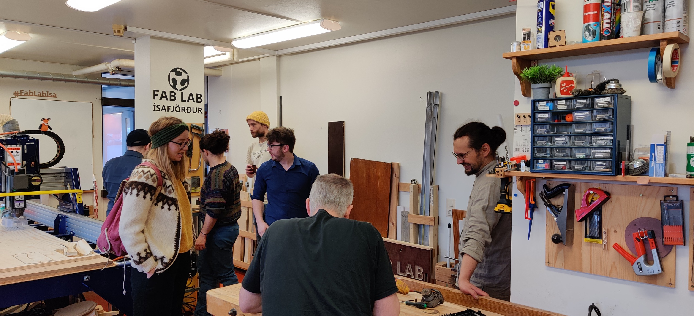

---
hide:
  #- navigation
  - toc
---

# Um smiðjuna

## **Fab Lab Ísafjörður**

{: align=left style="height:50%;width:50%"}

Fab Lab Ísafjörður hefur starfað frá 2012. Starfólk smiðjunnar hefur víðtæka þekkingu á nýsköpunarumhverfinu og frumgerðasmíðum. Við aðstoðum frumkvöðla, kennara og nemendur við að finna ýmsar lausnir. Á þriðjudögum og fimmtudögum er smiðjan opin hverjum sem er frá 15 - 19.

Utan þess er þó sjálfsagt að kíkja við. Fyrir stærri nýsköpunarverkefni er best að senda póst og við munum finna út hvernig við getum aðstoðað.

## **Hvað er Fab Lab?**

{: align=right style="height:50%;width:50%"}

Fab Lab stendur fyrir Fabrication Laboratory og á rætur sínar að rekja til námskeiðs við MIT sem heitir How to Make (Almost) Anything. Hér segir upphafsmaðurinn Neil Gershenfeld frá hugsjóninni að baki Fab Lab (pínulitli vefþjónninn sem hann talar um í byrjun heitir núna the Internet of Things og er úti um allt).

Í Fab Lab smiðjunni færðu tækifæri til að kynnast stafrænni framleiðslutækni. Það þýðir að þú sest niður og teiknar það sem þig vantar í tölvu og setur hlutinn síðan í framleiðslu. Þegar tölvustýrða tækið er búið að vinna, þá snyrtir þú hlutinn og setur saman. Oft er hægt að byggja samsetningar inn í hlutinn og sleppa við skrúfur og aðrar festingar.
 
Ef hluturinn virkar ekki þá gerirðu breytingar og býrð til annan. Ef fleiri en þú vilja nota hlutinn þá er hægt að setja teikninguna þína á netið og framleiða hlutinn í tíu Fab Lab smiðjum á Íslandi og í þúsund öðrum Fab Lab smiðjum um allan heim.
