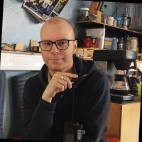
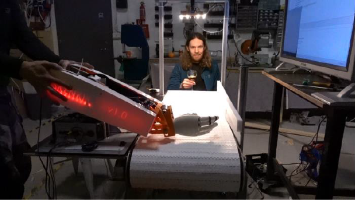
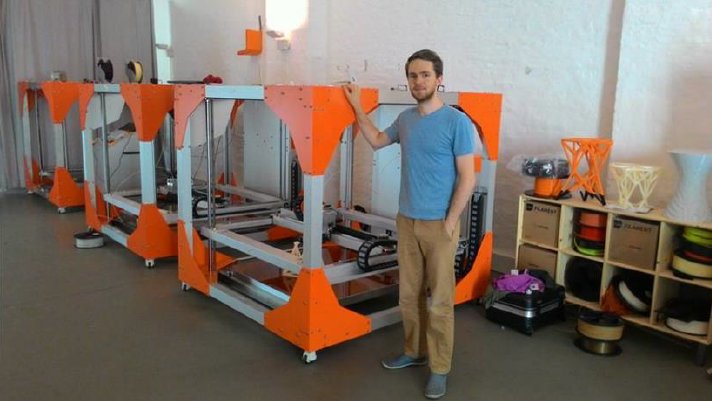
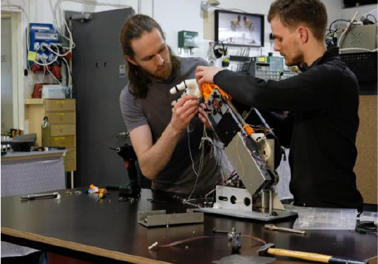

---
hide:
  #- navigation
  - toc
---

# Starfsfólk

---

Fab Lab Ísafjörður er tveggja manneskna teymi sem leggur áherslu á nýsköpun, sköpun, hönnun, framkvæmd og stuðning við menntakerfið, atvinnulífið, frumkvöðla og samfélagið í gegnum stafræna framleiðslutækni.  

Þórarinn Bjartur Breiðfjörð, forstöðumaður smiðjunnar, leiðir starfsemina, ásamt því að styðja notendur við fjölbreytt verkefni.   

Svavar Konráðsson er verkefnastjóri og kemur með reynslu sína í vélaverkfræði og frumkvöðlastarfsemi inn í smiðjuna. Hann hefur unnið að mörgum nýsköpunarverkefnum, þar á meðal 3D-prentun og hönnun báta.

## Staðsetning, tölvupóstur og símanúmer smiðjunar

|  Torfnes 400 Ísafjörður   |   info hjá fabisa.is   |   +354 450 4408  |

---

-   :cat:{ .lg .middle } __Þórarinn Bjartur Breiðfjörð - Forstöðumaður__

    ---
    { align=left }
    

    :fontawesome-regular-envelope: **Póstfang:** doddi hjá fabisa.is

    :fontawesome-solid-screwdriver-wrench: **Sérþekking:** Rafeindatækni

    :fontawesome-regular-star: **Uppáhalds forrit:** Blender 3D og Inkscape

    ---
    

    <iframe title="DjOddi" frameborder="0" allowfullscreen mozallowfullscreen="true" webkitallowfullscreen="true" allow="autoplay; fullscreen; xr-spatial-tracking" xr-spatial-tracking execution-while-out-of-viewport execution-while-not-rendered web-share width="640" height="480" src="https://sketchfab.com/models/ee9372ef321e405aa8503d4f69141c68/embed?autospin=1&autostart=1&preload=1&dnt=1"> </iframe>

    [:octicons-arrow-right-24: linkedin](https://www.linkedin.com/in/hanndoddi/)

    Þórarinn lauk sveinsprófi í rafeindavirkju 2009 og lauk Fab Akademíuna 2015 og hefur verið virkur leiðbeinandi fyrir nemendur um allt land og líka leiðbeint nemendum utan lands. Hann hefur starfað í smiðjunni síðan 2014. Þórarinn er sérlega góður í bilanagreiningu og er með víðtæka yfirsýn yfir nýsköpunarumhverfið í landinu.

    ---

    
    
    

-   :elephant:{ .lg .middle } __Svavar Konráðsson - Verkefnastjóri__

    ---
    { align=left }

    :fontawesome-regular-envelope: **Póstfang:** svavar hjá fabisa.is

    :fontawesome-solid-screwdriver-wrench: **Sérþekking:** Vélaverkfræði

    :fontawesome-regular-star: **Uppáhalds forrit**: Ondsel og KiCad

    ---
gith
    <iframe title="Scaniverse 2022-06-10 142722" frameborder="0" allowfullscreen mozallowfullscreen="true" webkitallowfullscreen="true" allow="autoplay; fullscreen; xr-spatial-tracking" xr-spatial-tracking execution-while-out-of-viewport execution-while-not-rendered web-share width="640" height="480" src="https://sketchfab.com/models/820d6e8c1d7744989cd0e9c1dabb1729/embed?autospin=1&autostart=1&preload=1&dnt=1"> </iframe>

    [:octicons-arrow-right-24: linkedin](https://www.linkedin.com/in/svavarkonradsson/)

    Svavar er vélaverkfræðingur og lauk Fab Akademíuni 2023 og stefnir á að verða leiðbeinandi í Fab Akademíuni. hann hefur starfað í smiðjuni síðan 2021. Svavar hefur góða þekkingu á CAD hönnun.   Hann er einn sá aðili sem kom team spark á stað 2012 og stofnaði 3D-prentun 2015.
     
     
    ---

 

