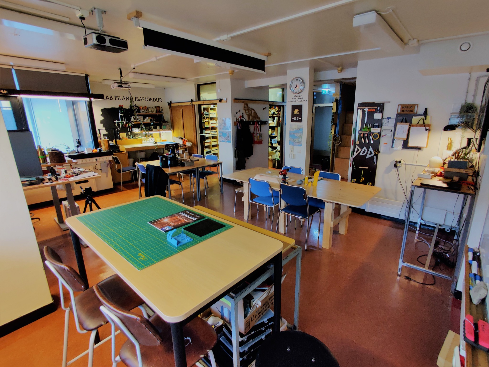
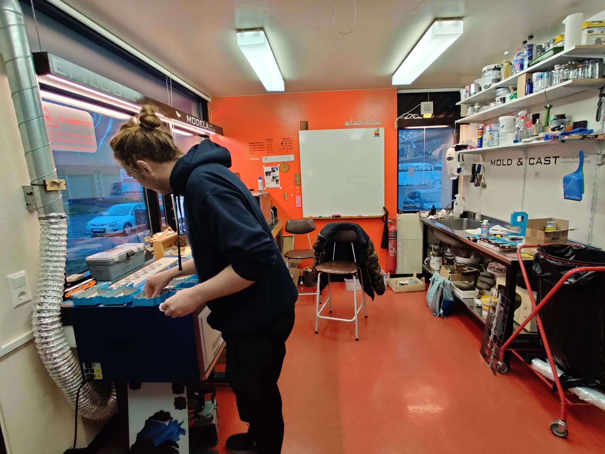
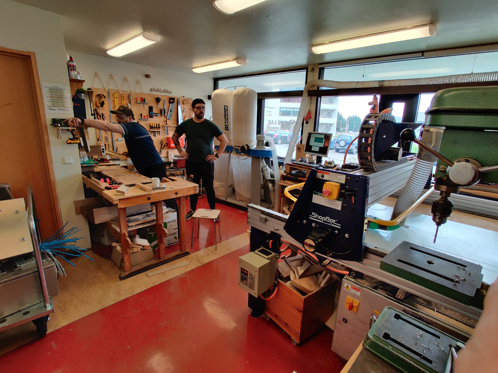
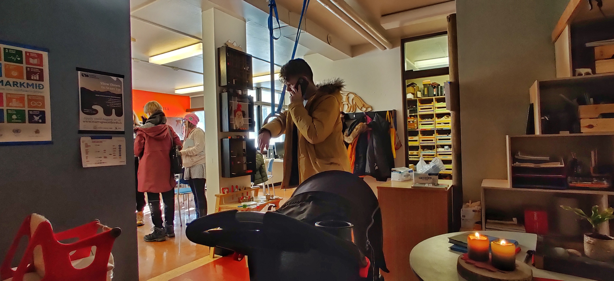
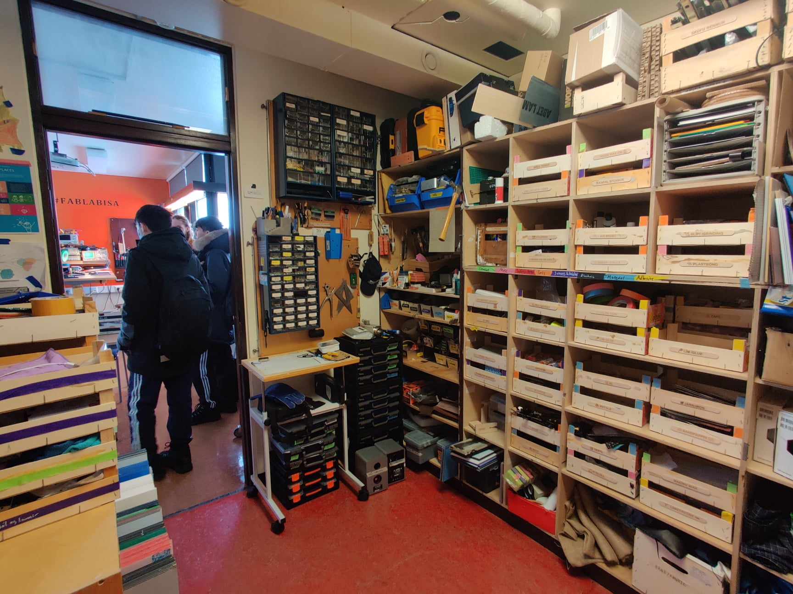

# Aðstaðan

## Vinnurými

Lítið en vel skipulagt vinnurými fyrir kennslu og vinnu í tölvum og samsetningu á frumgerðum

## Tækjarými

Rými fyrir tæki þar sem stutt er á milli tækja til að vinnuflæði verði sem best.

## rými fyrir stórafræsaran

Rými sem hentar vel fyrir grófaði vinnu þar sem þarf að vinna í hávaða eða/og með rykk.

## Kaffirými

Góður staður til að setjast niður og ræða hugmyndir og verkefni yfir góðum kaffibolla.

## íhluta og efnis lager

Við reynum eftir bestu getu að eiga efni sem erfitt er að fá annarstaðar. smiðjan er vel búinn SMD íhlutum til að búa til og laga rafrásir.

