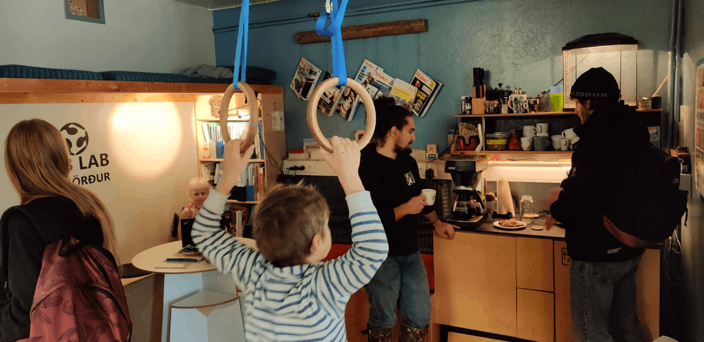

# Alþjóðasáttmáli

## Um sáttmálan

Fab Lab smiðjur um allan heim fylgja sáttmála sem kallast Fab charter og var búinn til 2007. allar smiðjur hafa sama vegvísi til að tryggja samræmt starf í öllum smiðjum.
í kaffi horninu á smiðjuni má sjá sáttmálan á ýmsum tungumálum.

### Fab sáttmálinn - Fab charter

## Hvað er Fab Lab - What is a fab lab?

Fab Lab er alþjóðlegt net staðbundinna smiðja sem leiða til  
uppfinninga með því að veita aðgang að búnaði fyrir stafræna framleiðslu.

Fab labs are a global network of local labs,  
enabling invention by providing access to tools for digital fabrication.

## Hvað felst í Fab Lab - What’s in a fab lab?

Kjarnahæfni Fab Lab smiðja gerir fólki kleift að búa til (nánast) hvað sem er.  
Hún er í sífelldri þróun og stuðlar að því að þekkingu og verkefnum sé deilt.

Fab labs share an evolving inventory of core capabilities  
to make (almost) anything, allowing people and projects to be shared.

## Hvað býður Fab Lab netið upp á - What does the fab lab network provide?

Stuðning við starfsemi, fræðslu, tækni, fjármál  
og ferla umfram það sem ein smiðja getur veitt.

Operational, educational, technical, financial, and  
logistical assistance beyond what’s available within one lab.

## Hverjir geta notað Fab Lab smiðjur - Who can use a fab lab?

Fab Lab smiðjur eru samfélagslegir innviðir sem bjóða  
upp á opið aðgengi fyrir einstaklinga jafnt sem skipulagða starfsemi.

Fab labs are available as a community resource, offering  
open access for individuals as well as scheduled access for programs

## Hver er þín ábyrgð - What are your responsibilities?

|                                                            |                 |                                                              |  |
| ------------ | ---------------------------------------------------------- | --------------- | ------------------------------------------------------------ |
| **Öryggi:**              | Að skaða hvorki fólk né búnað.                                                                                       | **Safety:**                    | Not hurting people or machines..                                                                                         |
| **Rekstur:**             | Að aðstoða við tiltekt, viðhald og endurbætur á smiðjunni.                                                           | **Operations:**                | Assisting with cleaning, maintaining, and improving the lab.                                                             |
| **Þekking:**             | Að leggja þitt af mörkum við skráningu og leiðsögn.                                                                  | **Knowledge:**                 | Contributing to documentation and instruction.                                                                           |
|                          |                                                                                                                      |                                |                                                                                                                          |

## Hver á Fab Lab uppfinningar - Who owns fab lab inventions?

Hönnun og aðferðir sem þróuð eru í Fab Lab smiðjum  
má bæði vernda og selja á þann hátt sem höfundur kýs en  
þekkingin ætti að vera aðgengileg einstaklingum til gagns og fróðleiks.

Designs and processes developed in fab labs can be  
protected and sold however an inventor chooses,  
but should remain available for individuals to use and learn from.

## Hvernig geta fyrirtæki nýtt sér Fab Lab - How can businesses use a fab lab?

Mögulegt er að nýta Fab Lab smiðjur fyrir atvinnulífið við mótun frumgerða og gerjun hugmynda.  
 Slík starfsemi ætti að vaxa út úr smiðjunni fremur en að vaxa innan hennar.  
 Hún ætti ekki raska annarri starfsemi Fab Lab og ætti að gagnast hugvitsfólki, 
smiðjum, samstarfsneti og vistkerfi nýsköpunar.

Commercial activities can be prototyped and incubated in a fab lab, 
 but they must not conflict with other uses, they should grow beyond rather 
  than within the lab, and they are expected to benefit the inventors,  
  labs, and networks that contribute to their success.

