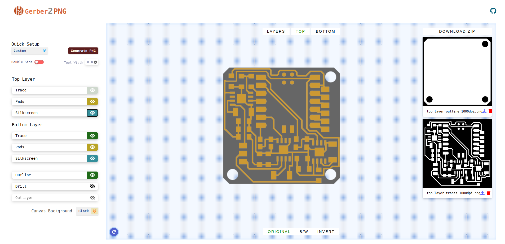

# Gerber 2 png

Verkfæri sem gerir okkur kleift að taka gerber skrá úr KiCad og breytta í PNG mynd sem við nottum til að fræsa rafrásir.

[Hlekkur á gerber2png](https://gerber2png.fablabkerala.in/){:rel="nofollow"}

## Leiðbeiningar á ensku

GerberViewer 

GerberViewer is an open-source web application that serves as a versatile tool for viewing Gerber files and streamlining the conversion of Gerber files into PNG images. 

## Table of Contents

- [Gerber 2 png](#gerber-2-png)
  - [Leiðbeiningar á ensku](#leiðbeiningar-á-ensku)
  - [Table of Contents](#table-of-contents)
  - [Features](#features)
  - [Getting Started](#getting-started)
    - [Prerequisites](#prerequisites)
    - [Installation](#installation)
  - [Usage](#usage)
  - [Contributing](#contributing)
  - [License](#license)

## Features

- Convert Gerber files to PNG images.
- Support for various Gerber file formats.
- Intuitive and responsive web interface.
- Easy-to-follow conversion process.
- Download converted PNG images instantly.

## Getting Started

### Prerequisites

Before using the Gerber-to-PNG Converter, make sure you have the following:

- A modern web browser (e.g., Chrome, Firefox, or Safari).
- Gerber files that you want to convert.

### Installation

No installation is required for this web application. Access it directly through your web browser 
## Usage

1. Navigate to the GerberViewer folder and Simply open the index.html file in the browser.
2. Click the "Choose File" button to select the Gerber file or drag and drop the files you wish to convert.
3. Wait for the conversion to finish; the visual representation of your Gerber File will appear.
4. You can toggle each layers of your PCB and Convert only the visible layers.
5. Conversion to PNG is available in both Original and Black&White and B/W Invert.
6. Click the download link under each image to save the converted PNG image to your computer or click the Download button in the taskbar to download the .zip file to your computer.

## Contributing

We believe in the power of open-source collaboration and welcome contributions from the community. Here's how you can get involved:

1. Fork the repository.
2. Create a new branch for your feature or bug fix.
3. Make your changes and commit them with clear, concise commit messages.
4. Push your branch to your fork.
5. Create a pull request with a detailed description of your changes.

## License

The Gerber-to-PNG Converter is open-source software distributed under the MIT License. Feel free to use, modify, and distribute it as per the terms of the license.

---

Thank you for considering contributing to the Gerber-to-PNG Converter project! If you have any questions or encounter issues, please don't hesitate to open an issue on our GitHub repository.

