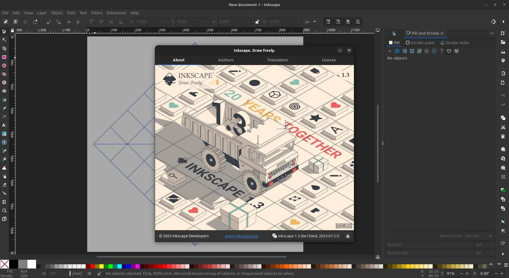
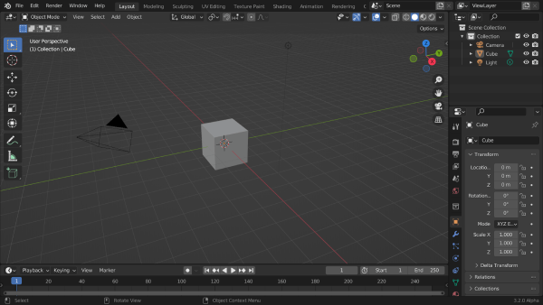
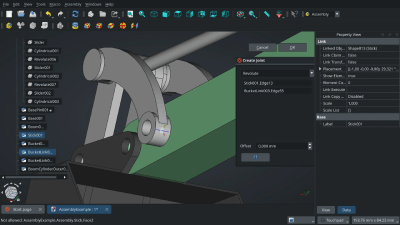
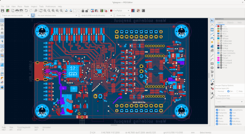
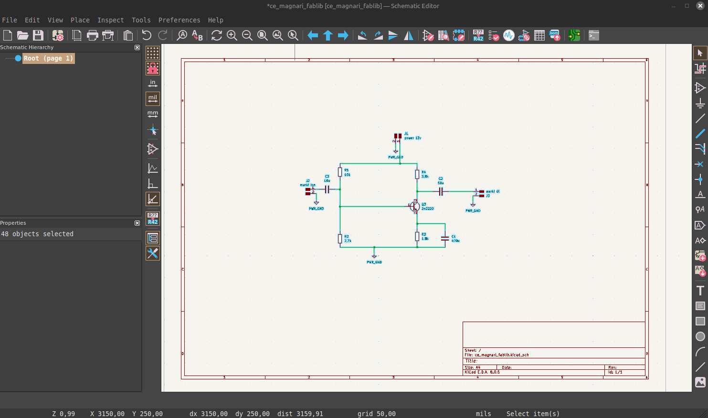
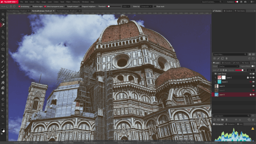
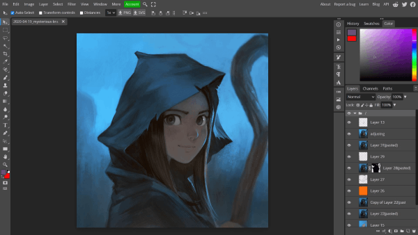

# Forrit

## Vector forrit

---

### Inkscape

Insckape er öflugt vector forrit sem við notum mikkið til að hanna ýmis verkefni. Inkscape er það forrit sem við byrjum að kenna flestum á.

{: style="height:70%;width:70%"}

---

### Ilustrator

Smiðjan er ekki með aðgagn að illustrator en við þekkum það ágætlega og kunnum að exporta úr því til að vinna með vélanar.

---

## 3D forrit

---

### Blender 3D

Blender er oflugt þvrívídar forrit sem er frábært til að búa til ýmis form og er mikkið notað í smiðjunni.

---

### Ondsel

Ondsel er búið til ofan á FreeCad og hefur reynst okkur vel það sem það er með þægilegu viðmóti og fljótlega hægt að ná góðum tökum á því.

---

### ThinkerCad

thinker Cad er sértaklega gott fyrir krakka það sem viðmótið er mjög einfalt og gott 3D forrit til að byrja í.

---

### Fusion 360

Fínt forrit sem við notuðum mikið í smiðjuni en höfum skipt yfir í Ondsel í kennslu.

---

### 3D Max

forrit sem við kunnum ekki mikið á en ekkert mál að vinna með það ef fólk er vant að vinna í því.

---

### Solidworks

Þekkjum það ágælega og notum það af og til í smiðjunni.

---

## rafrása forrit

---

### KiCad

KiCad er notað mikkið í smiðjuni til að hanna og búa til rafrásir. Forrit sem svoldið öðruvísi en lítið mál að kenna á.

{: style="height:50%;width:50%"}

---

### LTspice

Rafrásar hermir sem er notaður til að líkja eftir og greina rafrásir.

### DS view

!orrit sem er notað til að greina stafrænar rásir og lesa ýmsa samskipta staðla eins og I2C, UART, SPI, USB, CAN og fleiri.

### FlatCam

Notað til að vinna með gerber skrár til að búa til vélakóða til að fræsa út rafrásir.

---

### Altium Designer

Forrit sem við þekjum ekki vel en lítið mál að exporta gerber skrám og vinna með þær

---

## Myndvinnsu forrit

---

### Gimp

Fínt forrit til myndvinnslu. Svavar þekkir ágætlega á forritið.

---

### Photopea

Fínt forrit sem keyrir í vefvafra og er mjög líkt photoshop. Þórarinn notar forittið mikkið og á auðvelt með að kenna á það.

---

### Potoshop

Smiðjan er ekki með photoshop og við kunnum takmarkað að vinna með það en fyrir fólk sem er vant að nota það er lítið mál að nota það í smiðjuni.

---