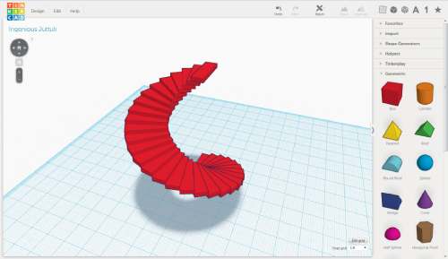

# Hugbúnaður

Við nýtum fjölbreyttan hugbúnað við stafræna framleiðsluferlið til að hanna og leysa fjölbreytt verkefni. Við notum opinn hugbúnað eins og Ondsel og Blender mikkið fyrir 3D hönnun, ásamt KiCad fyrir rafeindahönnun. Inkscape og GIMP eru notuð fyrir vektor- og myndvinnslu, og Cura fyrir sneiðingu 3D-prentunar. Til að stýra CNC-vélum notum við hugbúnað eins og VCarve og FlatCam. Hugbúnaðurinn sem við notum er bæði sveigjanlegur og notendavænn, hannaður til að hjálpa notendum að búa til og framleiða sín eigin verk.
Hér fyrir neðan eru öll þau forrit sem við vitum af, og við uppfærum listann reglulega.

## Vector forrit

---

### Inkscape

Insckape er öflugt vector forrit sem við notum mikkið til að hanna ýmis verkefni. Inkscape er það forrit sem við byrjum að kenna flestum á.

{: style="height:70%;width:70%"}

---

### Ilustrator

Illustrator er eitt af öflugustu verkfærunum til vektorhönnunar og er mikið notað til að undirbúa hönnun fyrir laserskurð og vinylskurð. Þrátt fyrir að smiðjan sé ekki með aðgang að Illustrator, þá þekkjum við það vel og kunnum að vinna með skrár úr því, t.d. með því að flytja út í sniðum eins og SVG eða DXF sem henta vélum okkar.

---

## 3D forrit

---

### Blender 3D

Blender er oflugt þvrívídar forrit sem er frábært til að búa til ýmis form og er mikkið notað í smiðjunni.

---

### Ondsel

Ondsel er byggt ofan á FreeCAD og hefur reynst vel með þægilegu viðmóti. FreeCAD er eitt vinsælasta opna hugbúnaðarkerfið fyrir 3D CAD hönnun og gerir það auðvelt að byggja upp flókna hönnun.

---

### ThinkerCad

thinker Cad er sértaklega gott fyrir krakka það sem viðmótið er mjög einfalt og gott 3D forrit til að byrja í.

---

### Fusion 360

Fusion 360 er öflugt CAD forrit sem við höfum notað mikið í smiðjunni. Forritið býður upp á margskonar möguleika fyrir 3D hönnun, samsetningar og jafnvel hermimódel. Þó að við notum Ondsel meira núna í kennslu, þá er Fusion 360 frábært fyrir samstarf í skýinu, sem gerir það auðvelt að vinna saman á fjarlægðum. Þetta gerir það gott til notkunar í flóknum verkefnum sem krefjast hönnunar milli smiðja.

Fínt forrit sem við notuðum mikið í smiðjuni en höfum skipt yfir í Ondsel í kennslu.

---

### 3D Max

forrit sem við kunnum ekki mikið á en ekkert mál að vinna með það ef fólk er vant að vinna í því.

---

### Solidworks

Þekkjum það ágælega og notum það af og til í smiðjunni.

---

## rafrása forrit

---

### KiCad

KiCad er notað mikkið í smiðjuni til að hanna og búa til rafrásir. Forrit sem svoldið öðruvísi en lítið mál að kenna á.

{: style="height:50%;width:50%"}

---

### LTspice

Rafrásar hermir sem er notaður til að líkja eftir og greina rafrásir.

### DS view

Forrit sem er notað til að greina stafrænar rásir og lesa ýmsa samskipta staðla eins og I2C, UART, SPI, USB, CAN og fleiri.

### FlatCam

Notað til að vinna með gerber skrár til að búa til vélakóða til að fræsa út rafrásir.

---

### Altium Designer

Forrit sem við þekjum ekki vel en lítið mál að exporta gerber skrám og vinna með þær

---

## Forritun

### VS code

Texta editor sem býður upp á góða möguleika til að vinna með forritun. Við mælum alltaf með því að læra inn á markdown sem við notum fyrir allt skipulag í kring um smiðjuna og vefsíðan okkar notar markdown sem vinur vel með HTML.

---

### Arduino IED

Arduino IDE er forrit sem er notað mikið í forritun fyrir rafeindaverkefni og örtölvur. Þetta forrit er sérstaklega vinsælt til að prófa og forrita örgjörva eins og Arduino, ESP32 og fleiri.

---

### Git

Git er útbreiddasta útgáfustjórnunarkerfið og heldur utan um breytingar á skrám og forritum með nákvæmum hætti. Það gerir kleift að vinna saman og fylgjast með öllum breytingum og endurheimta fyrri útgáfur auðveldlega. Git er sérstaklega mikilvægt fyrir samstarfsverkefni, þar sem margir vinna að sömu skrám og verkefnum á mismunandi stöðum. Það er mikið notað ásamt GitHub og GitLab til að stjórna forritunar- og Fab Academy verkefnum.

---

## Myndvinnsu forrit

---

### Gimp

Fínt forrit til myndvinnslu. Svavar þekkir ágætlega á forritið.

---

### Photopea

Fínt forrit sem keyrir í vefvafra og er mjög líkt photoshop. Þórarinn notar forittið mikkið og á auðvelt með að kenna á það.

---

### Potoshop

Smiðjan er ekki með photoshop og við kunnum takmarkað að vinna með það en fyrir fólk sem er vant að nota það er lítið mál að nota það í smiðjuni.

---

### Resolve

Notað til að vinna með video og býr yfir mjög mörgum góðum verkfærum til að klippa saman og búa til myndbönd.

---

## önnun forrit

### OBS - Open Broadcaster Software

Frábært streymi forrit sem býður upp á góða möguleika

---

### Cura

Notað til að setja upp hönnun í ultimaker. Forritið tekur .stl skrár meðal annars og breytir þeim í gcode vélarkóða.

---

### Vcarve

Notað til að taka hönnunar skrá eins og dxf, pdf og dxf og breyta í vélakóða. Vélakóðin sem við notum mest er .sbp og .nc.

---

### Sb3

Sb3 er stýriforrit sérstaklega þróað fyrir CNC-fræsara eins og ShopBot. Það tekur við vélakóða, t.d. í .sbp eða .nc formati, og keyrir fræsivélina samkvæmt þessum kóða. Forritið býður upp á mikla nákvæmni í stjórnun vélarinnar og gerir notendum kleift að keyra bæði einföld og flókin fræsiverkefni á öruggan og skilvirkan hátt.

---

### Universlal gcode sender

Universal Gcode Sender (UGS) er öflugt og sveigjanlegt forrit sem tekur við Gcode skrám og stýrir ýmsum CNC-vélum, svo sem fræsivélum og laserskurðarvélum. Það er sérlega hentugt til að stjórna STEM CNC vélum og býður upp á fjölbreyttar stillingar fyrir verkfærastjórnun og nákvæmni í vinnslu. UGS er vinsælt val í smiðjum þar sem margskonar vélar eru tengdar.

---

