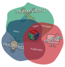
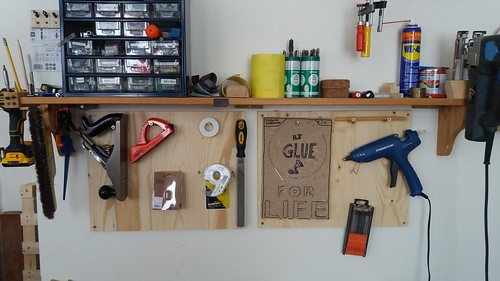

# Búnaður

{: align=right style="height:40%;width:40%"}

Smiðjan er búinn ýmsum tölvustýðum tækjum, tölvubúnaði, hugbúnaði og annarskonar búnaði sem gerir okkur kleyft að búa til nánast hvað sem er og leysa nánast hvað sem er.

Hér er listi yfir tölvustýrðar vélar í smiðjunni.

[Tækjabúnaður](taeki.md)

Hér er listi yfir helstu forrit sem við nottum.

[Hugbúnaður](hugbunadur.md)

Hér er list yfir annarskonar búnað sem við erum með.

[Annar búnaður](verkbunadur.md)

{: style="height:100%;width:100%"}