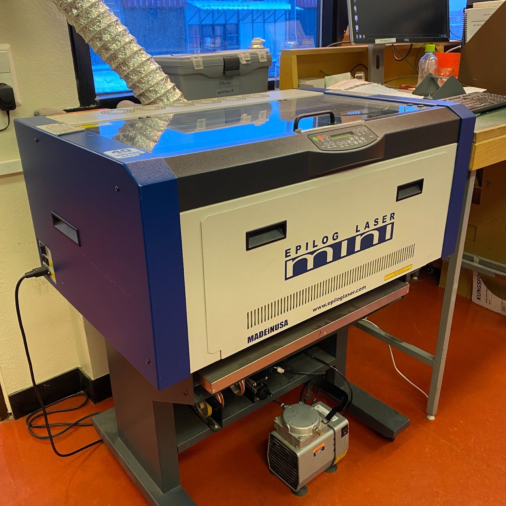
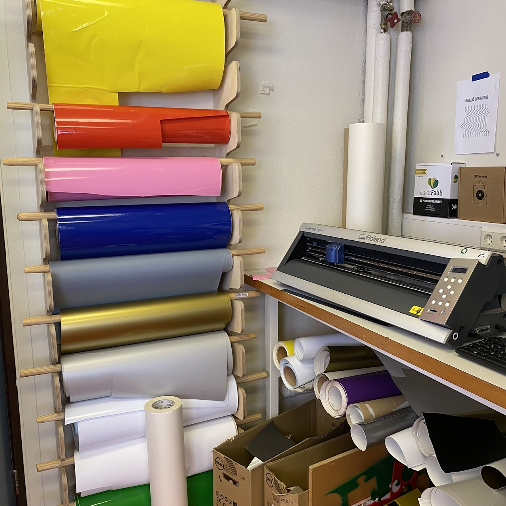
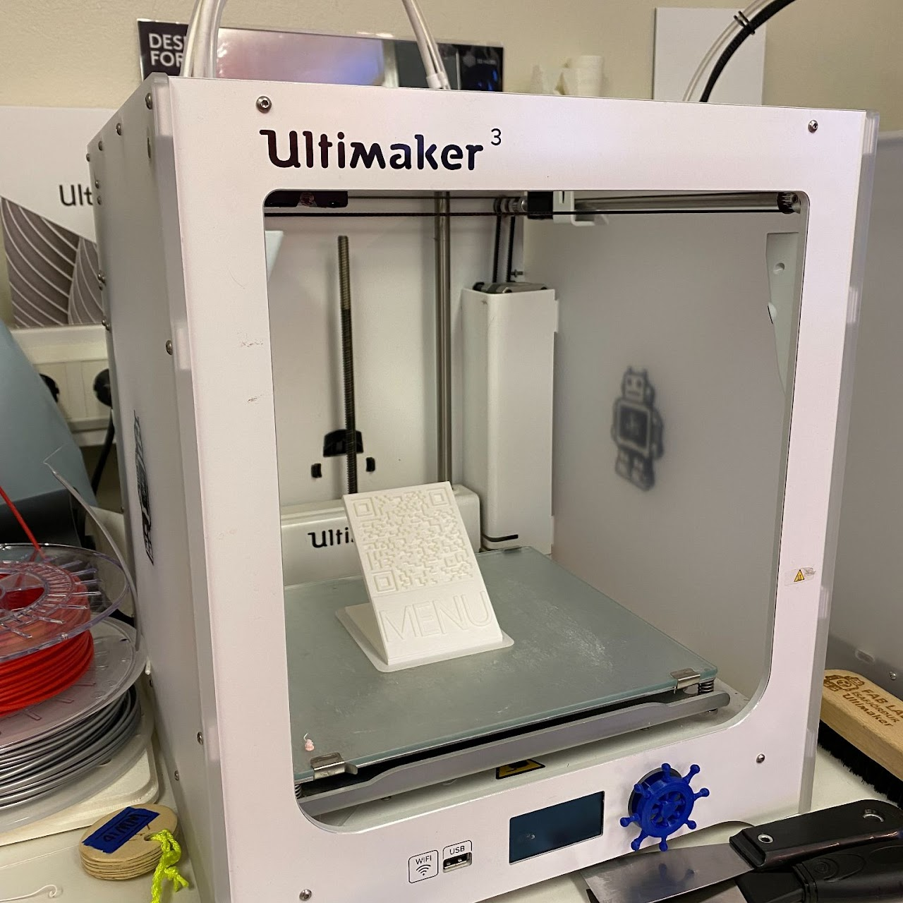

# Tækjabúnaður

### Fræsarar

---

#### modela mdx

lítil fræsari sem við notum mikið til að gera frumgerðir af rafrásum.

Dæmi

---

#### Carvey

Litil fræsari sem er afar hentugur fyrir byrjendur og til kennslu.

Dæmi

---

#### Shop-bot

Stór fræsari sem ræður við stór verkefni og ýmis efni.

{: style="height:60%;width:60%"}

Dæmi:

---

### Skurðarvélar

#### Eplog mini laser

Leisir skeri sem fljólegt er að skera í 2D og einig hægt að merkja í hluti. Mikkið notaður með bylgju pappa til að prófa frumgerðir.

{: style="height:60%;width:60%"}

---

#### Roland Camm

Vínilskeri sem er mikið notaður við kennslu í grunskólum til að læra á stafræn verkefni þar sem nemendur hanna verkefnin í tölvu og læra að koma hönnun úr tölvu í tæki. Mest notum við vínil filmur en við skerum líka pappír og sveigjanlegar rafrásir.

{: style="height:60%;width:60%"}

---

### 3D prentarar

{: style="height:40%;width:40%"}

#### Ultimaker 2 

3D prentarar eru mikið notaðir til að búa til flókin form og í kennslu til að læra inn á 3D forrit eins og [Blender 3d]() og [Ondsel]()

#### Ultimaker 3

Nýri útgáfa af ultimaker 3 sem auðvelt er að nota með usb prentarinn sér líka um að stilla sig sjálfur sem einfaldar hlutina töluvert fyrir byrjendur.

---

### Annað

#### Presius plastic vélar

Smiðjan er með nokrar vélar til að endurvinna plast og búa til hrafefni. Við erum líka með rými í vinnsu til að vinna með vélanar.

---

  
