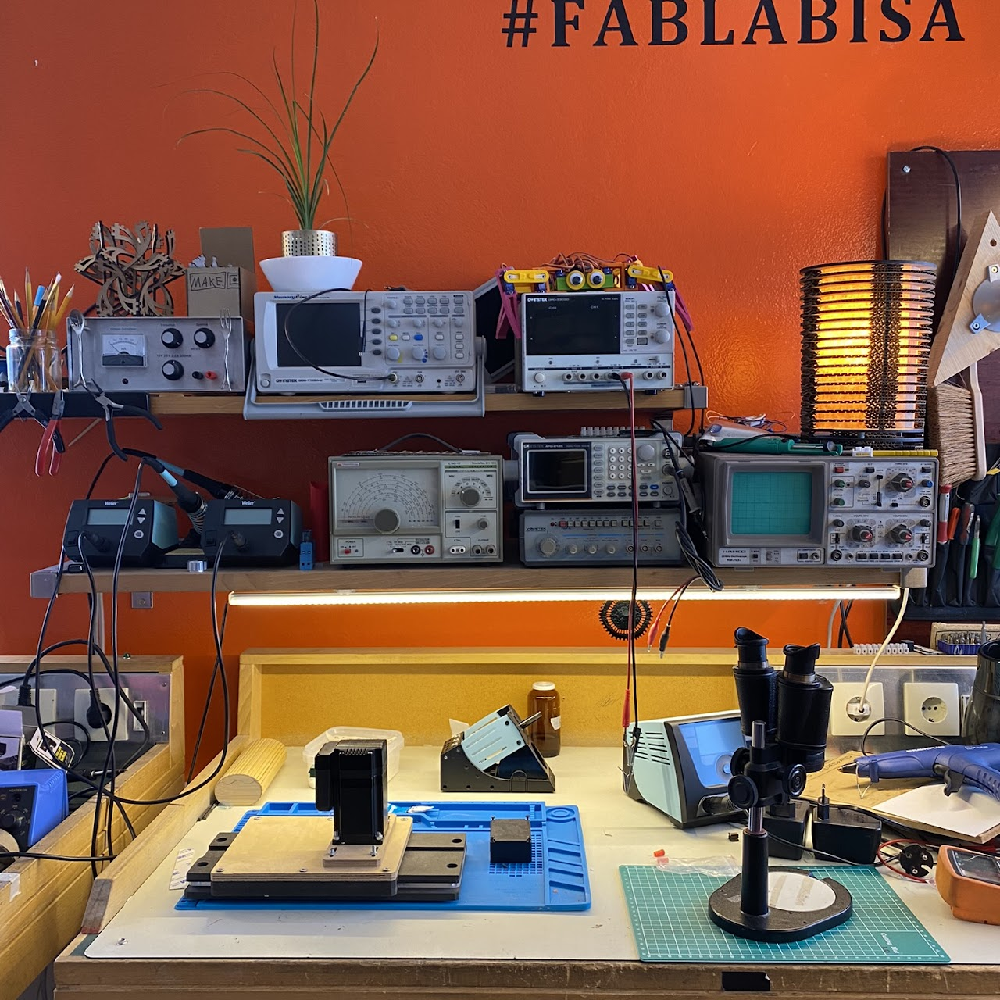
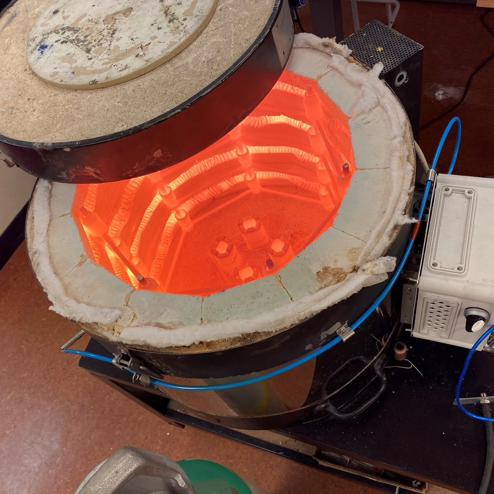

# Annar búnaður

## Rafeinda þróunar búnaður

Í smiðjuni eru helstu tæki til að prófa og búa til rafrásir. Það sem við höfum til taks er eftirfarandi:

- Sveiflusjár
  - Analog
  - Digital
- Tíðnivakar
  - Analog
  - Digital
- Avo mælar
- Apertöng
- lóðboltar fyrirbæði SMD og trough hole íhluti.
- Hitabyssa fyrir SMD íhluti
- Víðsjá til að vinna með SMD rásir
- Spennugjafa    
- Logic analizer

## Keramic ofn

